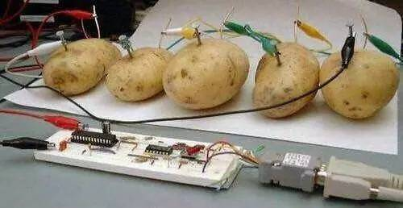

# QQ Hackers Bomber

QQ盗号骗子炸弹，让骗子原地爆炸。

花了几分钟时间，给这个骗子网站<http://nuiyyz.cn/Ru_op>写的。

为了能有一个更好的交流体验，我使用英语写了这个`README.md`文件。`README-zh_CN.md`也是提供的。<README-zh_CN.md>

## 为什么不使用多线程？ 

在我的压力测试中，我以500毫秒一次POST请求的速度，一分钟后，这个服务器崩溃了，我只提交成功了一百余次请求。

这个服务器是土豆做的，所以我放弃使用多线程。

为了插入更多的垃圾数据，每次请求的间隔被设置到了大约5秒。

好处显而易见；骗子的服务器可以得到充分的休息，我也可以做我的工作。在后台运行时，它占用了不到1%的CPU资源，几乎不占用网络。

一晚上，我生成了三千条垃圾然后上传上去了。

## 为什么写这么多代码来生成“随机”密码？

因为爱情。

生成逼真的密码可以保护那些把自己真的密码交给骗子的那些傻白甜们。

我假设1/20的人使用字母和数字的完全随机密码，因为置信区间和小概率事件定理的存在。然后我双倍了0.05的置信区间两次。

详情在我的代码中。

## 如何使用？

打开命令行环境，键入 `pip install -r requirements.txt`。

编辑 `bomber.py`，71行，修改为你的上传数据。Progress Telerik Fiddler 被推荐用于网页调试。

然后运行 `python bomber.py`。

享受吧。

七月 25日, 2019